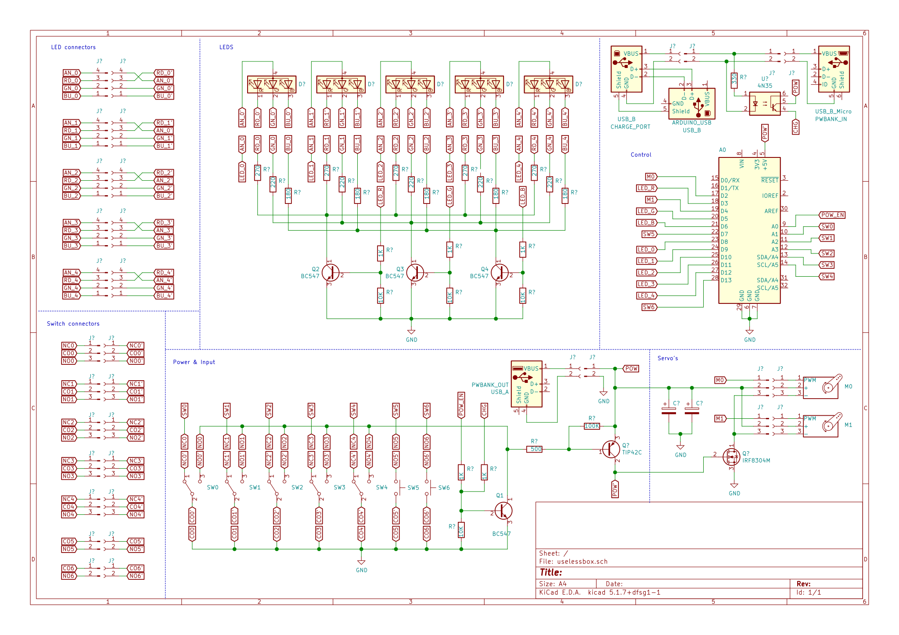
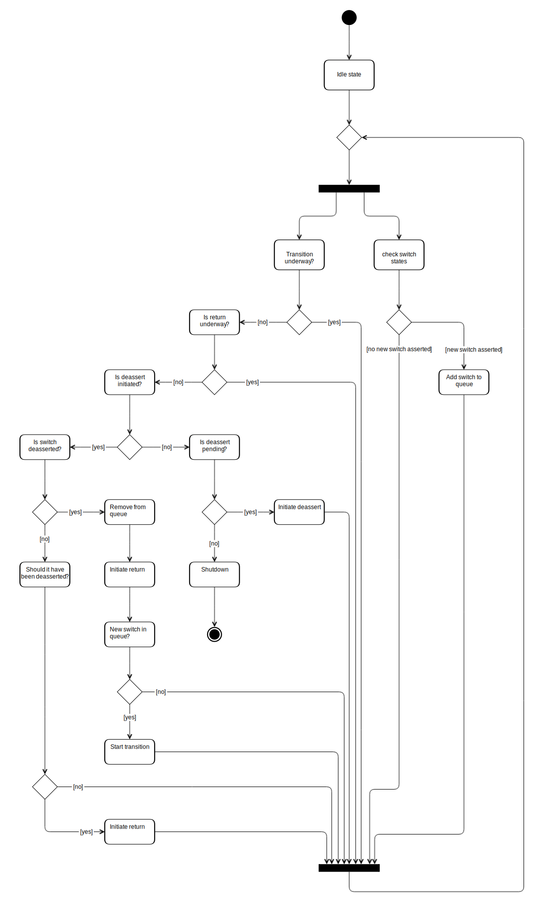

# uselessbox

A very useless box

## Why

No reason, otherwise it wouldn't be useless.

Off course, I'm joking. You wouldn't be here if it was actually usesless. It wouldn't have been built either. There are a number of uses/modes to it:

* Puzzle - The box has a puzzle mode, in which only a specific order of switching is allowed.
* Checkbox - The main reason it was built. During my work, I needed a reminder to check if I'm on the right course every once in a while.
* Fun - The mode where it just acts as a classic useless box, albeit more extensive, with 5 switches and LED's.

Finally the experience of building it was one of the main drivers for the project. Mainly dusting of my knowledge in embedded programming and electronics, as well as gaining some experience with woodworking.

## Electronics design

I wanted to build a useless box, but I had some additional requirements as well:

* It needs to work on batteries, and thus it needs to be able to switch itself off completely.
* I needed to be able to built it with stuff I accumulated through the years.
* It needed to be more than just the simple old classic useless box. After looking for some inspiration I stumbled upon [this](https://youtu.be/eLtUB8ncEnA) super cool one.
* It needs some RGB leds to be able to use it as a sort of "checkbox" with green and red colors to trigger me more into actually using it.

In the end, this is the design I came up with:

I used `KiCAD` to create the schematics.

The cool thing about it is that it can be turned on by toggling any of the switches. After it has turned them off itself, it can choose to power itself off, or linger. Whatever is usefull for the current mode it is in. I chose to pull them low because that way I didn't need pull-down resistors. The MCU on the Arduino has built-in pull-up resistors. It also makes using a P-channel mosfet or pnp transistor easier, which turned out, was a requirement.

The RGB LED's are multiplexed and connected to the Arduino in such a way that the color lines can be PWM'ed if desirable. There are two additional buttons, hidden under the lid, that I can use to switch modes or add additional behaviour is I choose to do so.

The battery that powers the complete box is a USB power bank I had lying around. To prevent the motors from diping the MCU's voltage and causing brown-out, I switched them separately. For the motors a simple n-channel configuration was sufficient. For the Arduino, this type of swicthing wasn't possible, because the internals of the Arduino without power, would let the pin that is connected to the gate/base through to the 5v power supply. Therefore a PNP transistor was used here (I had no P-channel mosfets at hand).

## Software design

The core of the software is a fairly simple state-machine. Here's the corresponding activity diagram:

The end result became a bit different, but I haven't found time to sync them up. This captures the essence though. There isn't an actual queue of switches in code. It just finds the nearest to go to next. Also, the puzzle mode isn't in here, but that one just postpones acting on switches until one is asserted in an order it doesn't expect. Plus there is a nice circling rainbow effect when the puzzle is solved.

## Result

I've built all of this on prototype board, which I plugged on top of the Arduino like a shield.

